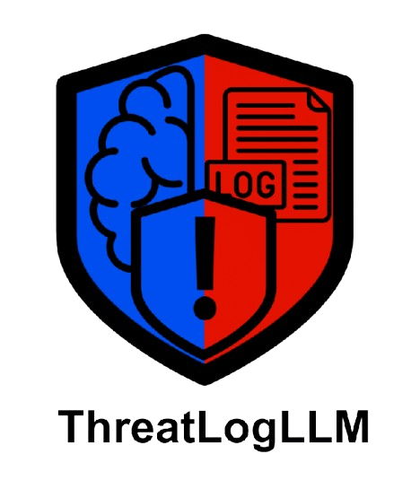
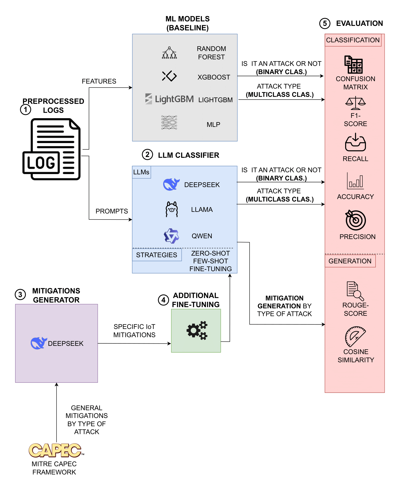

<h1>
   ThreatLogLLM
</h1>


**Language Models for Threat Detection in IoT Security Logs**

ThreatLogLLM is a research project focused on evaluating the use of Large Language Models (LLMs) for cybersecurity tasks involving log analysis in IoT environments. The project explores the use of LLMs for:

- ✅ Binary classification (attack vs normal)
- ✅ Multiclass classification (attack type, if attck is detected)
- ✅ Generation of custom mitigation strategies for each detected attack

LLMs are compared against traditional Machine Learning models baselines, demonstrating superior performance in multiclass classification and showing potential for automated mitigation generation.

---

## 📂 Project Structure

```
├── LLMs-mitigation-gen/ # Generation of mitigations with DeepSeek
│   └── countermeasures_w_deepseek.ipynb
├── LLMs-training/  # Classification with LLMs (DeepSeek, LLaMA, Qwen) 
│   ├── data-prep/
│   ├── deepseek/
│   │   ├── binary/     # Zero-shot, Few-shot and fine-tuning
│   │   ├── multiclass/ # Zero-shot, Few-shot and fine-tuning
│   │   └── multiclass_countermeasures/ # mitigations fine-tuning
│   ├── llama3.2/
│   │   ├── binary/     # Zero-shot, Few-shot and fine-tuning
│   │   ├── multiclass/ # Zero-shot, Few-shot and fine-tuning
│   │   └── multiclass_countermeasures/ # mitigations fine-tuning
│   └── qwen2.5/
│   │   ├── binary/     # Zero-shot, Few-shot and fine-tuning
│   │   ├── multiclass/ # Zero-shot, Few-shot and fine-tuning
│   │   └── multiclass_countermeasures/ # mitigations fine-tuning
├── ML-training/        # Classical ML baseline models
│   ├── ml_binary.ipynb
│   └── ml_multiclass.ipynb
├── data/               # Dataset, CAPEC info and prompts generation
│   ├── capec/
│   ├── dataset-csv/
│   └── prompts/
```

---

## 🚀 How to Run

> The current version is implemented in Jupyter Notebooks.

1. Clone the repository:

```bash
git clone https://github.com/Jorge-Tejero-Fdez/ThreatLogLLM.git
cd ThreatLogLLM
```

2. Create a virtual environment and install dependencies:

```bash
pip install -r requirements.txt
```

3. Open the notebooks and follow the pipeline steps inside each subfolder.

> ⚠️ A GPU is required to run fine-tuned LLMs. The author uses an NVIDIA RTX 4060.

---

## 📊 Tasks and Evaluation

### 🧠 Classification

Each LLM (DeepSeek, LLaMA, Qwen) is used for:

- Binary classification (is attack / normal)
- Multiclass classification (type of attack, if attack is detected)

These are evaluated using:

- `Accuracy`
- `Precision`
- `Recall`
- `F1-score`
- `Confusion matrix`

(Metrics computed with `scikit-learn`)

### 🛡️ Mitigation Generation

- Based on general mitigations from [CAPEC](https://capec.mitre.org/)
- Custom IoT mitigations are generated using DeepSeek
- LLMs are fine-tuned to generate specific mitigations upon detecting a given attack

These are evaluated using:

- `ROUGE Score` (`rouge_score`)
- `Cosine Similarity` (`sentence-transformers`)
---
## 🧪 Methodology

The complete workflow for ThreatLogLLM is illustrated below:

<p align="center">
  
</p>

The pipeline is divided into five stages:

---

### 1. **Preprocessed Logs**

Raw logs from the [Edge-IIoTset](https://www.kaggle.com/datasets/dhritikagoyal/edgeiiot-dataset) dataset are cleaned and transformed. Two parallel paths are then followed:
- Extracted **features** are used to train ML models.
- **Prompt-based input** is fed into LLMs.

---

### 2. **LLM Classifier**

Three language models are evaluated:
- **DeepSeek**
- **LLaMA**
- **Qwen**

Each is tested in three different configurations:
- **Zero-shot**
- **Few-shot**
- **Fine-tuned**

These models are evaluated in both:
- **Binary classification**: is there an attack?
- **Multiclass classification**: what type of attack?

---

### 3. **Mitigation Generator**

General attack mitigations are collected from the [CAPEC](https://capec.mitre.org/) framework. These are transformed into **specific IoT mitigations** using DeepSeek as a generative model. These custom mitigations serve as training data for the next stage.

---

### 4. **Additional Fine-Tuning**

Each LLM is further fine-tuned to not only classify the attack but also generate **context-specific mitigation strategies** as output immediately after classification. This allows the models to act as intelligent assistants capable of real-time response generation.

---

### 5. **Evaluation**

The models are evaluated across two fronts:

#### 📊 Classification:
- `Accuracy`, `Precision`, `Recall`, `F1-score`, `Confusion Matrix`  
(using `scikit-learn`)

#### 🛡️ Generation:
- `ROUGE Score` (via `rouge_score`)
- `Cosine Similarity` (via `sentence-transformers`)
---

## 📦 Dataset

This project uses the [Edge-IIoTset](https://www.kaggle.com/datasets/dhritikagoyal/edgeiiot-dataset), a labeled dataset of IoT traffic logs containing a variety of attacks including:

- SQL Injection
- Port Scanning
- MITM
- DDoS (TCP, UDP, ICMP, HTTP)
- XSS
- Backdoor
- Ransomware
- and more

All preprocessing steps are included inside the notebooks.

---

## 🔧 Requirements

- Python ≥ 3.10
- GPU (recommended)
- Tested on RTX 4060
- Main dependencies:
  - `transformers`
  - `scikit-learn`
  - `sentence-transformers`
  - `rouge_score`
  - See `requirements.txt` for full list

---

## 🧪 Results Summary

- LLMs outperform traditional ML models in multiclass classification.
- Fine-tuned LLMs are able to generate meaningful mitigations aligned with CAPEC recommendations.
- DeepSeek is the most effective model overall, followed by LLaMA.

---

## 📜 License

No license applied yet.

---

## 🙌 Acknowledgements

- CAPEC Project
- Edge-IIoTset Dataset
- Unsloth and Hugging Face ecosystem